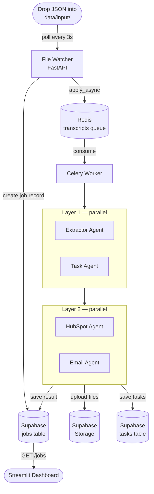
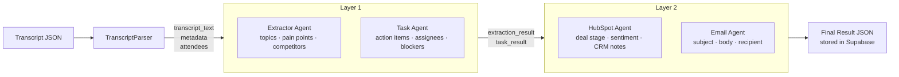
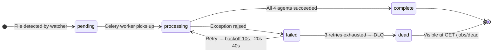
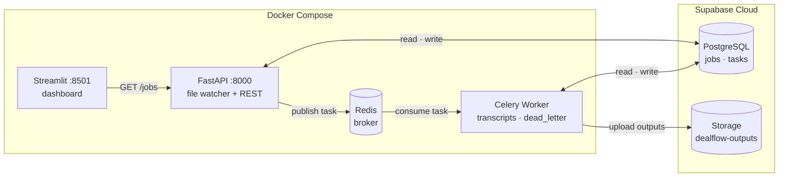

# DealFlow

> **Automated Sales Call Intelligence Pipeline** — Watches a folder for Fireflies.ai transcript JSON files, processes them through a multi-agent AI pipeline, and surfaces results in a live dashboard. Built on **Google ADK** with **Gemini AI**.


---

## Table of Contents

- [Overview](#overview)
- [Architecture](#architecture)
- [Agents](#agents)
- [Project Structure](#project-structure)
- [Installation](#installation)
- [Configuration](#configuration)
- [Usage](#usage)
- [API Reference](#api-reference)

---

## Overview

DealFlow automates post-sales-call workflows. Drop a Fireflies.ai transcript JSON into the watched folder and the pipeline:

1. Detects the new file within 3 seconds
2. Extracts key topics, pain points, and competitor mentions
3. Generates actionable tasks assigned to internal team members
4. Recommends a CRM deal stage, sentiment score, and HubSpot notes
5. Composes a professional follow-up email to the client
6. Persists all outputs to Supabase and surfaces them in a live Streamlit dashboard

---

## Architecture

### Full Pipeline Flow



### Agents Pipeline



### Job Lifecycle



### Deployment Model



---

## Agents

All agents use the Gemini model set in `GEMINI_MODEL_NAME`.

### Layer 1 — runs in parallel

**Extractor Agent** — scans the transcript for business signals

| Field | Description |
|---|---|
| `topics[]` | Topic name and a short summary |
| `pain_points[]` | Client frustrations, blockers, complaints |
| `competitors[]` | Competitor or alternative solution names |

**Task Agent** — maps commitment language to specific team members

| Field | Description |
|---|---|
| `tasks[].assignee` | Internal employee name |
| `tasks[].action_items` | Clear imperative task description |
| `tasks[].blocker` | Dependency or blocker, null if none |

### Layer 2 — runs in parallel, fed by Layer 1 output

**HubSpot Agent** — translates call outcomes into CRM field updates

| Field | Description |
|---|---|
| `deal_stage_recommendation` | Discovery / Demo / Proposal / Negotiation / Closed |
| `perceived_sentiment` | Qualitative client disposition assessment |
| `competitor_threat_level` | Low / Medium / High |
| `hubspot_notes_body` | Professional meeting summary for CRM |

**Email Agent** — composes a contextualised follow-up email

| Field | Description |
|---|---|
| `recipient_email` | Client email address |
| `email_subject` | Action-oriented subject line |
| `email_body` | Full email with greeting, body, action items, sign-off |

---

## Project Structure

```
DealFlow/
├── api.py                        # FastAPI — file watcher loop, REST endpoints
├── ui.py                         # Streamlit dashboard — polls FastAPI every 3s
├── main.py                       # CLI entry point — single-file batch mode
├── requirements.txt
│
├── worker/
│   ├── celery_app.py             # Celery config — Redis broker, queue routing
│   └── tasks.py                  # process_transcript task + dead letter handler
│
├── core/
│   ├── config.py                 # Env vars, Supabase client
│   └── orchestrator.py           # Runs both parallel agent layers, persists output
│
├── agents/
│   ├── extractor_agent/          # agent.py · prompts.py · schema.py
│   ├── task_agent/               # agent.py · prompts.py · schema.py
│   ├── crm_agent/                # agent.py · prompts.py · schema.py
│   └── email_agent/              # agent.py · prompts.py · schema.py
│
├── services/
│   ├── job_service.py            # Supabase CRUD for jobs table
│   ├── database_services.py      # Supabase CRUD for tasks table
│   ├── storage_services.py       # Supabase Storage uploads to dealflow-outputs
│   ├── jobs_table_schema.sql     # jobs table DDL
│   └── tickets_table_schema.sql  # tasks table DDL
│
├── utils/
│   └── transcript_parser.py      # Fireflies JSON → structured dict
│
└── data/
    └── input/                    # Drop transcripts here — auto-created on startup
```

---

## Installation

### Option A — Docker Compose (recommended)

```bash
git clone <repository-url>
cd DealFlow

cp .env.example .env
# Fill in all values in .env

docker compose up --build
```

Dashboard available at `http://localhost:8501`.

### Option B — Local

Requires Python 3.10+ and a running Redis instance.

```bash
git clone <repository-url>
cd DealFlow

python -m venv venv
source venv/bin/activate

pip install -r requirements.txt

cp .env.example .env
# Fill in all values in .env
```

---

## Configuration

| Variable | Description | Required |
|---|---|---|
| `GOOGLE_API_KEY` | Google Cloud API key for Gemini | Yes |
| `GEMINI_MODEL_NAME` | Gemini model name (e.g. `gemini-2.5-flash`) | Yes |
| `GEMINI_BASE_URL` | Gemini API base URL | Yes |
| `REDIS_URL` | Redis connection URL including credentials | Yes |
| `SUPABASE_URL` | Supabase project URL | Yes |
| `SUPABASE_KEY` | Supabase service role key | Yes |
| `API_BASE_URL` | FastAPI base URL (default: `http://localhost:8000`) | No |

---

## Usage

### Docker Compose

```bash
docker compose up
```

Drop any Fireflies.ai transcript JSON into `data/input/`:

```bash
cp my_transcript.json data/input/
```

The file is detected within 3 seconds, dispatched to the Celery worker, processed through all four agents, and results appear in the dashboard.

### Local — three terminals

```bash
# Terminal 1 — FastAPI
uvicorn api:app --host 0.0.0.0 --port 8000

# Terminal 2 — Celery worker
celery -A worker.celery_app worker --loglevel=info -Q transcripts,dead_letter

# Terminal 3 — Streamlit dashboard
streamlit run ui.py
```

### CLI Mode — no server needed

```bash
python main.py path/to/transcript.json

# Or with the built-in sample
python main.py --sample
```

---

## API Reference

### `GET /health`
```json
{ "status": "ok", "broker": "redis", "queue": "transcripts" }
```

### `GET /metrics`
Returns queue depth, active task count, and job counts by status.

### `GET /jobs`
Returns all jobs newest first with `id`, `meeting_id`, `source_file`, `status`, and timestamps.

### `GET /jobs/{job_id}`
Returns the full job record including the complete result payload from all four agents.

### `GET /jobs/dead`
Returns all jobs that exhausted retries and landed in the dead letter queue.

**Job status flow:** `pending` → `processing` → `complete` / `failed` → `dead`