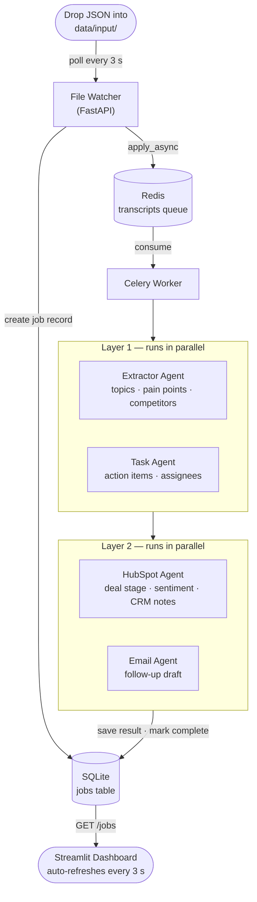
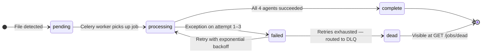
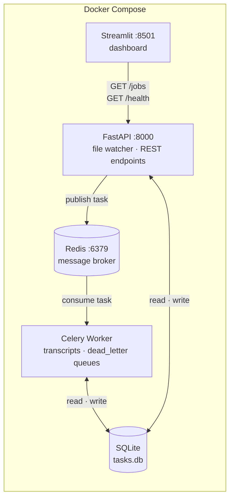

# DealFlow

> **Automated Sales Call Intelligence Pipeline** — Watches a folder for Fireflies.ai transcripts, processes them through a multi-agent AI pipeline, and surfaces results in a live dashboard. Built on **Google ADK** with **Gemini AI**.


---

## Table of Contents

- [Overview](#overview)
- [Features](#features)
- [Architecture](#architecture)
- [Agents](#agents)
- [Project Structure](#project-structure)
- [Installation](#installation)
- [Configuration](#configuration)
- [Usage](#usage)
- [API Reference](#api-reference)
- [Output Examples](#output-examples)

---

## Overview

DealFlow is an intelligent multi-agent system that automates post-sales-call workflows. Drop a Fireflies.ai transcript JSON into a watched folder and the pipeline automatically:

1. **Detects** the new file within 3 seconds
2. **Extracts** key topics, pain points, and competitor mentions
3. **Generates** actionable JIRA-style tasks assigned to internal team members
4. **Updates** CRM (HubSpot) with deal stage recommendations and sentiment analysis
5. **Composes** a professional follow-up email to the client
6. **Streams** live status to a Streamlit dashboard — no manual triggering needed

---

## Features

- **Zero-click pipeline** — drop a file, results appear automatically
- **File watcher** — polls `data/input/` every 3 seconds for new transcripts
- **Celery + Redis task queue** — decoupled, persistent job dispatch with at-least-once delivery
- **Retry with backoff** — failed jobs are retried up to 3 times (30 s → 60 s → 120 s)
- **Dead letter queue** — jobs that exhaust retries are routed to a DLQ and surfaced via `/jobs/dead`
- **Live dashboard** — Streamlit polls the FastAPI backend and updates in real time
- **Job history** — every run is stored in SQLite; click any past job to reload its results
- **Multi-agent processing** — four specialised Gemini agents run in two parallel layers
- **Structured output** — Pydantic schemas ensure validated, consistent JSON responses

---

## Architecture

### System Overview



### Job Lifecycle



### Deployment Model



---

## Agents

All agents use the Gemini model configured in `GEMINI_MODEL_NAME`.

### Layer 1 — Parallel Execution

#### Extractor Agent
Scans the transcript for business-relevant exchanges and returns structured insights.

| Output field | Description |
|---|---|
| `topics[]` | Topic name + 2–3 sentence summary |
| `pain_points[]` | Client complaints, bottlenecks, frustrations |
| `competitors[]` | Competitor or alternative solution names mentioned |

#### Taskmage Agent
Maps commitment language to specific internal employees.

| Output field | Description |
|---|---|
| `tasks[].assignee` | Internal employee name |
| `tasks[].action_items` | Clear imperative task definition |
| `tasks[].blocker` | Dependency or blocker, null if none |

### Layer 2 — Parallel Execution (fed Layer 1 output)

#### HubSpot Agent
Translates call outcomes into CRM-ready field updates.

| Output field | Type | Description |
|---|---|---|
| `deal_stage_recommendation` | string | Discovery / Demo / Proposal / Negotiation / Closed |
| `perceived_sentiment` | string | Qualitative assessment of client disposition |
| `competitor_threat_level` | Low / Medium / High | Based on competitor mentions and evaluation signals |
| `hubspot_notes_body` | string | Consolidated professional meeting summary |

#### Email Agent
Composes a contextualised follow-up email referencing specific discussion points.

| Output field | Description |
|---|---|
| `recipient_email` | Client email address |
| `email_subject` | Specific, action-oriented subject line |
| `email_body` | Structured email with greeting, body, action items, sign-off |

---

## Project Structure

```
DealFlow/
├── api.py                          # FastAPI app — file watcher, REST endpoints
├── ui.py                           # Streamlit dashboard — read-only, polls FastAPI
├── main.py                         # CLI entry point (single-file batch processing)
├── requirements.txt
│
├── worker/
│   ├── celery_app.py               # Celery config — Redis broker, queue routing, delivery guarantees
│   └── tasks.py                    # process_transcript task + handle_dead_letter DLQ sink
│
├── core/
│   ├── config.py                   # Paths, env vars, ensure_directories()
│   └── orchestrator.py             # DealFlowOrchestrator — runs both parallel agent layers
│
├── agents/
│   ├── extractor_agent/
│   │   ├── agent.py, prompts.py, schema.py
│   ├── task_agent/
│   │   ├── agent.py, prompts.py, schema.py
│   ├── crm_agent/
│   │   ├── agent.py, prompts.py, schema.py
│   └── email_agent/
│       ├── agent.py, prompts.py, schema.py
│
├── services/
│   ├── job_service.py              # SQLite CRUD for the jobs table
│   ├── database_services.py        # SQLite CRUD for the tasks table
│   ├── storage_services.py         # File output handling (output/)
│   ├── jobs_table_schema.sql       # jobs table DDL
│   └── tickets_table_schema.sql    # tasks table DDL
│
├── utils/
│   └── transcript_parser.py        # Fireflies JSON → structured dict
│
└── data/                           # Runtime directories (auto-created, git-ignored)
    ├── input/                      # ← drop transcripts here
    ├── processing/                 # file lives here while job is running
    ├── processed/                  # file archived here on completion
    ├── output/                     # agent output files
    └── tasks.db                    # SQLite database
```

---

## Installation

### Option A — Docker Compose (recommended)

Requires Docker and Docker Compose.

```bash
# 1. Clone the repository
git clone <repository-url>
cd DealFlow

# 2. Configure environment
cp .env.example .env
# Edit .env and set GOOGLE_API_KEY and GEMINI_MODEL_NAME

# 3. Start all services (Redis, API, Celery worker, Dashboard)
docker compose up --build
```

The dashboard will be available at `http://localhost:8501`.

### Option B — Local Setup

Requires Python 3.10+ and a running Redis instance.

```bash
# 1. Clone and enter the repository
git clone <repository-url>
cd DealFlow

# 2. Create a virtual environment
python -m venv venv
source venv/bin/activate   # Windows: venv\Scripts\activate

# 3. Install dependencies
pip install -r requirements.txt

# 4. Configure environment
cp .env.example .env
# Edit .env and add GOOGLE_API_KEY, GEMINI_MODEL_NAME, CELERY_BROKER_URL
```

---

## Configuration

### Environment Variables

| Variable | Description | Required |
|---|---|---|
| `GOOGLE_API_KEY` | Google Cloud API key for Gemini | Yes |
| `GEMINI_MODEL_NAME` | Gemini model to use (e.g. `gemini-2.5-flash`) | Yes |
| `CELERY_BROKER_URL` | Redis broker URL (default: `redis://redis:6379/0`) | No |
| `CELERY_RESULT_BACKEND` | Redis result backend URL (default: `redis://redis:6379/1`) | No |
| `API_BASE_URL` | FastAPI base URL (default: `http://localhost:8000`) | No |

### Auto-Created Directories

On first run, the following directories are created automatically:

| Directory | Purpose |
|---|---|
| `data/input/` | Drop transcript JSON files here |
| `data/processing/` | Temporary — file lives here during processing |
| `data/processed/` | Archive — file moved here after completion |
| `data/output/` | Generated output files (hubspot JSON, email TXT, full JSON) |

---

## Usage

### Docker Compose (recommended)

```bash
docker compose up
```

Then drop any Fireflies.ai transcript JSON into `data/input/`:

```bash
cp my_transcript.json data/input/
```

The file is detected within 3 seconds, dispatched to the Celery worker via Redis, processed through all four agents, and results appear in the dashboard at `http://localhost:8501`.

### Local — three separate terminals

```bash
# Terminal 1 — FastAPI (file watcher + REST endpoints)
uvicorn api:app --host 0.0.0.0 --port 8000

# Terminal 2 — Celery worker
celery -A worker.celery_app worker --loglevel=info -Q transcripts,dead_letter

# Terminal 3 — Streamlit dashboard
streamlit run ui.py
```

### CLI Mode (single file, no server needed)

```bash
python main.py path/to/fireflies_transcript.json

# Or using the sample transcript
python main.py --sample
```

---

## API Reference

### `GET /health`
Returns server and broker status.

```json
{ "status": "ok", "broker": "redis", "queue": "transcripts" }
```

### `GET /jobs`
Returns a summary list of all jobs, newest first.

```json
[
  {
    "id": "7c2c2e723518...",
    "meeting_id": "ff-20250108-ml-001",
    "source_file": "transcript.json",
    "status": "complete",
    "created_at": "2026-06-07T10:00:00Z",
    "started_at": "2026-06-07T10:00:03Z",
    "completed_at": "2026-06-07T10:01:12Z"
  }
]
```

**Job status values:** `pending` → `processing` → `complete` / `failed` → `dead`

### `GET /jobs/dead`
Returns all jobs that exhausted retries and were routed to the dead letter queue.

```json
[
  {
    "id": "3a9f1b...",
    "source_file": "transcript.json",
    "status": "dead",
    "error_message": "[DLQ] ConnectionError: ...",
    "created_at": "2026-06-07T10:00:00Z"
  }
]
```

### `GET /jobs/{job_id}`
Returns the full job record including the complete agent result payload.

```json
{
  "id": "7c2c2e723518...",
  "status": "complete",
  "result": {
    "agent_1_extraction": { "topics": [...], "pain_points": [...], "competitors": [...] },
    "agent_2_tickets":    { "tasks": [...] },
    "agent_3_hubspot":    { "deal_stage_recommendation": "...", ... },
    "agent_4_email":      { "recipient_email": "...", "email_subject": "...", "email_body": "..." },
    "metadata":           { "meeting_id": "...", "title": "...", ... }
  }
}
```

---

## Output Examples

### Extraction
```json
{
  "topics": [
    {
      "topic_name": "API Integration Requirements",
      "summary": "Discussion around REST API endpoints, authentication methods, and rate limiting for their use case."
    }
  ],
  "pain_points": [
    "Current provider has unreliable uptime (99.5% vs promised 99.9%)",
    "Lack of dedicated support channel causing delayed responses"
  ],
  "competitors": ["CompetitorX", "AltSolution Pro"]
}
```

### Tasks
```json
{
  "tasks": [
    { "assignee": "Sarah Chen", "action_items": "Send SOC2 compliance documentation", "blocker": null },
    { "assignee": "Mike Rodriguez", "action_items": "Provision sandbox environment", "blocker": "Requires legal NDA approval" }
  ]
}
```

### HubSpot
```json
{
  "deal_stage_recommendation": "Demo/Validation",
  "perceived_sentiment": "Cautiously optimistic — interested but raising concerns about migration complexity",
  "competitor_threat_level": "Medium",
  "hubspot_notes_body": "Customer evaluating due to reliability issues with current provider..."
}
```

### Email
```json
{
  "recipient_email": "john.smith@clientcorp.com",
  "email_subject": "Follow-up: API Integration & Security Discussion",
  "email_body": "Hi John,\n\nThank you for taking the time to speak with us today..."
}
```

---

## License

MIT License — see the LICENSE file for details.

---

<div align="center">

**Built with Google ADK & Gemini AI**

</div>
