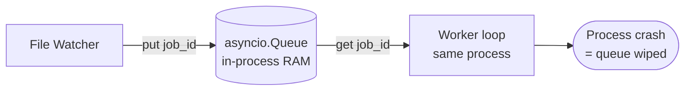
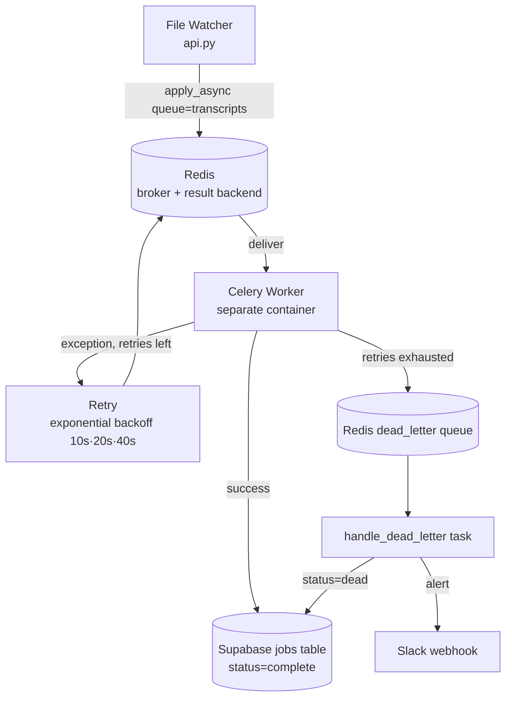

# Migrating DealFlow's Job Queue to Celery + Redis

## Why we migrated

DealFlow's file watcher (`api.py`) detects new transcripts and needs to hand each one off to a long-running AI pipeline (4 Gemini agent calls + Supabase writes) without blocking the watcher loop. The original approach used an in-process `asyncio.Queue`: the watcher put job IDs on the queue and a worker loop inside the same process consumed them.

That design had three problems that mattered in production:

1. **No durability** — the queue lived in process memory. If the API process crashed or was redeployed, every job sitting in the queue (and any job mid-processing) was silently lost. There was no record that the job had ever existed.
2. **No horizontal scaling** — processing happened in the same process as the HTTP server. The only way to process more transcripts concurrently was to scale the entire API process, which also meant the file watcher and REST endpoints scaled together with the AI workload for no reason.
3. **No retry or failure isolation** — a transient Gemini/Supabase error killed the job outright. There was no structured way to retry, and no record of which jobs had failed so they could be investigated.

## How Celery + Redis solved it

Redis acts as a durable message broker and result backend; Celery workers run as a **separate process** (and separate container in Docker Compose) that pulls jobs off Redis independently of the FastAPI process.

- **Durability**: once `process_transcript.apply_async(...)` returns, the task is persisted in Redis — an API restart no longer loses in-flight work, and `task_acks_late=True` means a task is only removed from the queue after the worker finishes it, not when the worker picks it up. If the worker process dies mid-task, the task is redelivered to another worker (`task_reject_on_worker_lost=True`).
- **Horizontal scaling**: `worker` is a separate Docker Compose service. Concurrency is controlled independently with `--concurrency=2`, and additional worker containers can be added without touching the API.
- **Retry + isolation**: Celery's `bind=True, max_retries=3` gives each task automatic retry with exponential backoff, and a second queue (`dead_letter`) isolates permanently-failed jobs so a bad transcript can't block the `transcripts` queue.

## Architecture

### Before — in-process queue



### After — Celery + Redis



## Implementation

### 1. Celery app configuration

`worker/celery_app.py` wires Celery to Redis using a single `REDIS_URL` (used for both broker and result backend) and routes the two task names to two distinct queues:

```python
app.conf.update(
    broker_url=redis_url,
    result_backend=redis_url,
    task_acks_late=True,
    task_reject_on_worker_lost=True,
    task_routes={
        "worker.tasks.process_transcript": {"queue": "transcripts"},
        "worker.tasks.handle_dead_letter": {"queue": "dead_letter"},
    },
)
```

### 2. Dispatching a job from the file watcher

`api.py`'s polling loop creates a `jobs` row in Supabase first (so the job is durable even before Celery sees it), then hands the job ID to Celery:

```python
job_id = job_service.create_job(raw, source_file=json_file.name)
process_transcript.apply_async(args=[job_id], queue="transcripts")
```

### 3. The task: retry with backoff, then dead-letter

`worker/tasks.py` defines the processing task with bounded retries and an exponential backoff schedule (10s → 20s → 40s):

```python
@app.task(bind=True, max_retries=3, queue="transcripts", name="worker.tasks.process_transcript")
def process_transcript(self, job_id: str) -> None:
    ...
    except Exception as exc:
        retry_num = self.request.retries + 1
        if retry_num <= self.max_retries:
            countdown = (2 ** self.request.retries) * 10
            raise self.retry(exc=root, countdown=countdown)
        handle_dead_letter.apply_async(args=[job_id, str(root)], queue="dead_letter")
        raise
```

### 4. Dead-letter handling and alerting

Once retries are exhausted, a dedicated task (on its own queue) marks the job `dead` and notifies the team via Slack — so failures are visible without anyone polling the database:

```python
@app.task(queue="dead_letter")
def handle_dead_letter(job_id: str, error: str) -> None:
    _job_service.update_job_status(job_id, "dead", error_message=f"[DLQ] {error}")
    alert_slack(job_id, error)
```

### 5. Observability

`GET /metrics` (`api.py`) inspects the live Celery cluster via `celery_app.control.inspect()` to report queue depth and active task counts alongside job counts by status from Supabase — giving a single endpoint to monitor both the broker and the database state.

## Result

| Aspect | Before | After |
|---|---|---|
| Job survives process crash | No | Yes — persisted in Redis + Supabase |
| Processing scales independently of API | No | Yes — separate `worker` container, tunable concurrency |
| Automatic retry on transient failure | No | Yes — 3 retries, 10s/20s/40s backoff |
| Failure visibility | None | `dead_letter` queue + Slack alert + `GET /jobs/dead` |
